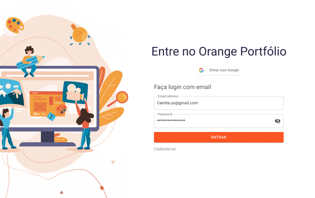
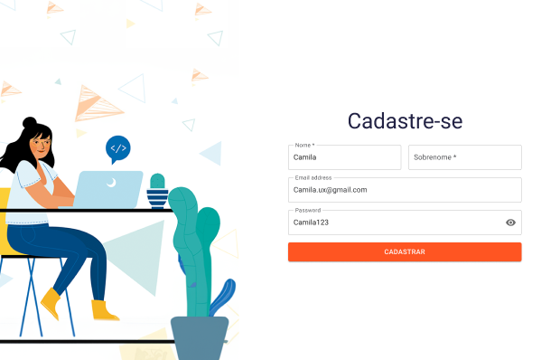
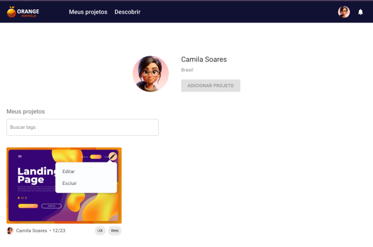
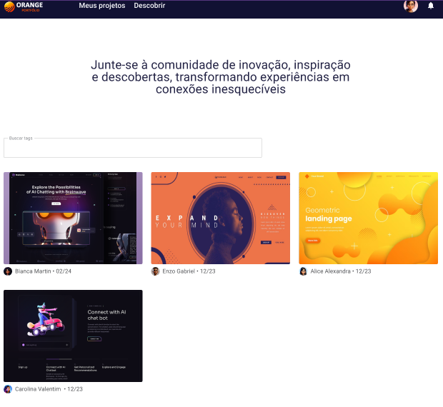
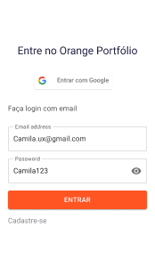
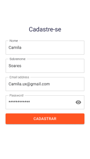
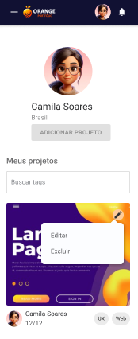

<div align="center">
 <h1>Programa de Formação FCamara V5.0 - 2024</h1>
 <h1>Hackathon - Projeto Orange Portfólio </h1>
 <h2>Squad 21 -  Backend<h2>
</div>

## Uma página criada especialmente para hospedar o seu portfólio dev!


### 💻 Sobre o Projeto

---

Este projeto foi criado pela Squad 21, no decorrer dos 15 dias do Programa de Formação da Orange Juice. Os participantes envolvidos - Bruna Furtado, Eduardo da Rocha, Gleison Fernandes e Luisa Lopes - se dividiram entre Frontend e Backend, a fim de otimizar a programação; assim sendo, o Frontend se comunica com o Backend em um MVP totalmente funcional. 

O Orange Portfólio visa alcançar os seguintes objetivos:

* Realizar o cadastro de novos usuários;
* Permitir o login de cada um desses usuários;
* Oferecer um servidor no qual os usuários podem fazer upload de seus portfólios dev.

Assim sendo, o Orange Portfólio como um todo é, essencialmente, um projeto de CRUD (Create, Read, Update, Delete).  

[Aqui está o link do protótipo do projeto](https://www.figma.com/file/utDx59m5Opz1lDSN1J4r9I/Desafio---Programa-de-Forma%C3%A7%C3%A3o-5.0?type=design&node-id=214-3448&mode=design&t=XkXMyjfGfU7Zn09J-0)!

### 🖵 Telas da aplicação

---

#### - 🖥️ Desktop

<h5>Tela de Login</h5>

<br>
<br>

<h5>Tela de Cadastro</h5>

<br>
<br>

<h5>Tela de Projetos</h5>

<br>
<br>

<h5>Tela de Descobrir Projetos</h5>

<br>
<br>

#### - 📱Mobile

<h5>Tela de Login Mobile</h5>

<br>
<br>

<h5>Tela de Cadastro Mobile</h5>

<br>
<br>

<h5>Tela de Projetos Mobile</h5>

<br>
<br>

<h5>Tela de Descobrir Projetos</h5>


### 💾 Tecnologias usadas

---

- [Node.js](https://nodejs.org/en)
- [ReactJS](https://react.dev/)
- [TypeScript](https://www.typescriptlang.org/)
- [MUI](https://mui.com/)

### 🛠️ Como posso começar a utilizar o serviço de hospedagem? 

---

É muito simples! Basta [acessar esse link](#) e criar uma conta para desfrutar dos serviços do Orange Portfólio!(ATUALMENTE INDISPONÍVEL)

### 🛠️ Executando o projeto localmente (Linux ou Windows)

---

#### Através do GitHub

````
git clone https://github.com/eduardodarocha/squad-21-frontend.git

cd squad-21-backend

yarn install

yarn dev
````

#### 👨🏻‍💻 Idealizadores

* Bruna Furtado, [BruFurtado](https://github.com/BruFurtado)
* Eduardo da Rocha, [eduardodarocha](https://github.com/eduardodarocha)
* Gleison Fernandes, [gleisonfernandes](https://github.com/gleisonfernandes/)
* Luisa Lopes, [herlocksholmes1888](https://github.com/herlocksholmes1888)

Agradecimentos especiais à equipe de mentores do Programa de Formação, que nos ajudaram no decorrer de todo o processo!