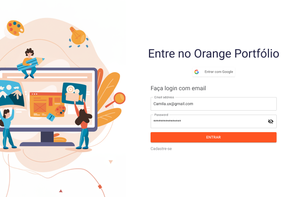

# FRONTEND Orange Portfólio - Programa de Formação v5.0

## Uma página criada especialmente para hospedar o seu portfólio dev!

Este projeto foi criado pela Squad 21, no decorrer dos 15 dias do Programa de Formação da Orange Juice. Os participantes envolvidos - Bruna Furtado, Eduardo da Rocha, Gleison Fernandes e Luisa Lopes - se dividiram entre Frontend e Backend, a fim de otimizar a programação; assim sendo, o Frontend se comunica com o Backend em um MVP totalmente funcional. 

O Orange Portfólio visa alcançar os seguintes requisitos:

* Realizar o cadastro de novos usuários;
* Permitir o login de cada um desses usuários;
* Oferecer um servidor no qual os usuários podem fazer upload de seus portfólios dev.

Assim sendo, o Orange Portfólio como um todo é, majoritamente, um projeto de CRUD (Create, Read, Update, Delete).  

[Aqui está o link do protótipo do projeto](https://www.figma.com/file/utDx59m5Opz1lDSN1J4r9I/Desafio---Programa-de-Forma%C3%A7%C3%A3o-5.0?type=design&node-id=214-3448&mode=design&t=XkXMyjfGfU7Zn09J-0)!

### Como posso começar a utilizar o serviço de hospedagem? 

É super simples! Basta [acessar esse link](#) e criar uma conta para desfrutar do Orange Portfólio! (ATUALMENTE INDISPONÍVEL)